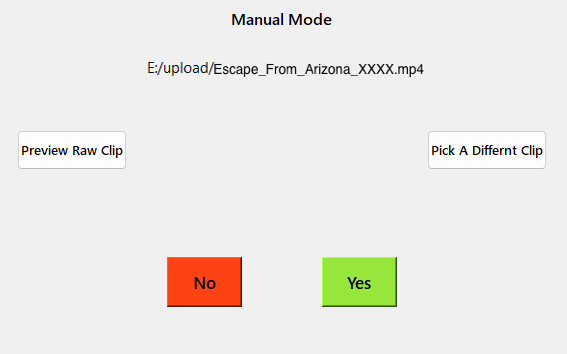
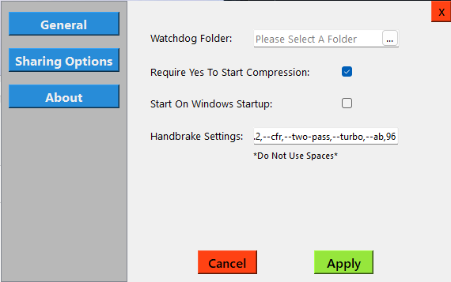
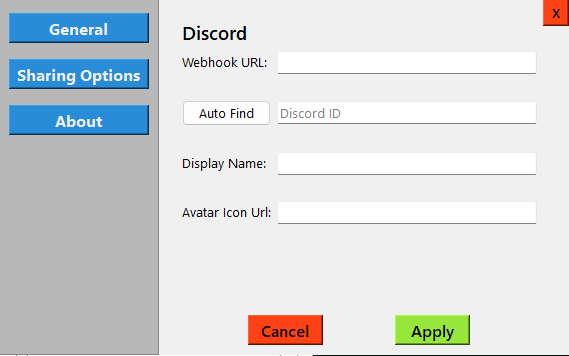
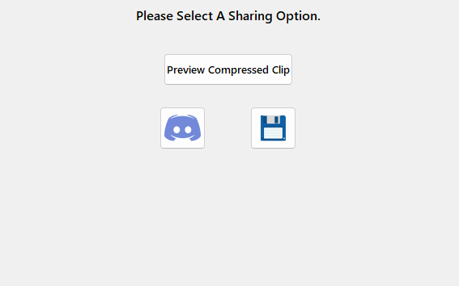

# Q.U.A.C.K.E.D

*Q uick.Universal .Automatic .Compression .Kept .Easily .Done , Automatically compresses video clips using [Handbreak](https://handbrake.fr/) that are created in a specified folder and uploads them to a specified Discord server. Giving you great looking clips that can be sent without paying for Discord Nitro!*

-----

## Table of Contents

- [Features](#features)
- [Compatibility](#compatibility)
- [Setup](#setup)
- [Run](#run)
- [Usage](#usage)
- [Contributing](#contributing)
- [License](https://github.com/donnie58744/Q.U.A.C.K.E.D/blob/main/LICENSE)

### Features

- Automatic clip detection and compression
- Manual clip compression
- Custom Discord message
- Windows Tray Icon

### Compatibility

- Windows 10/11

### Setup

- #### Settings

  - Right click tray icon

  - Click settings

  - ##### General Settings

    

  - ##### Sharing Setting

    

### Run

- Just double click the `Q.U.A.C.K.E.D.exe`

### Usage

- Record or add a clip to the **Watchdog Folder** you selected, you will then see the Yes/No dialog to compress

- After compression it will then ask you if you want to **Save** the clip, send to **Discord**, or **Preview** the clip

  

### Contributing

- Donovan Whysong ([Afghan Coder](https://github.com/donnie58744)) - Head Of Programming
- [Handbreak](https://handbrake.fr/) - Compression Software

### License

- View [Here](https://github.com/donnie58744/Q.U.A.C.K.E.D/blob/main/LICENSE)